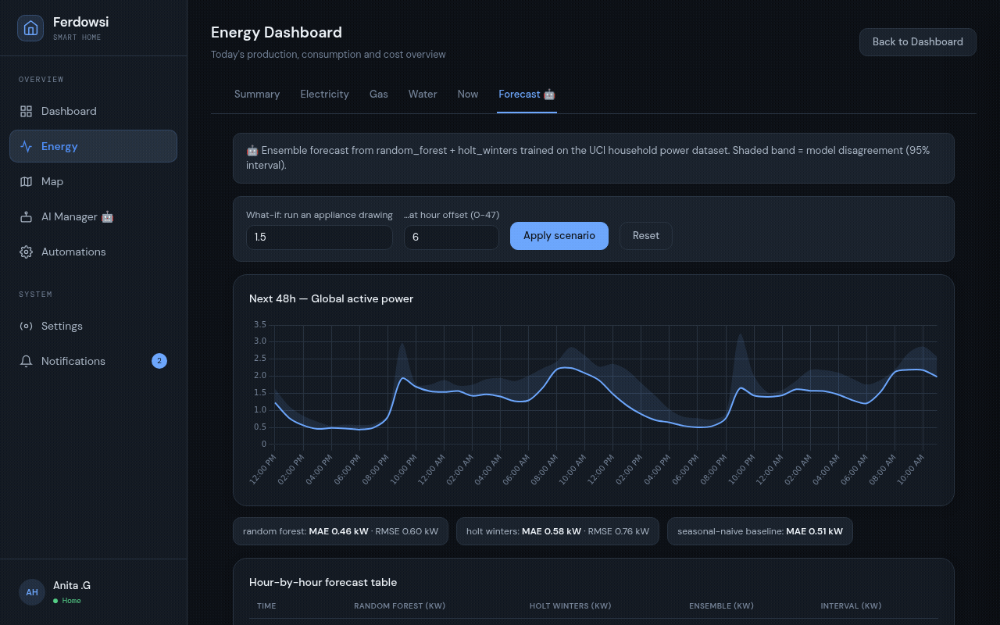
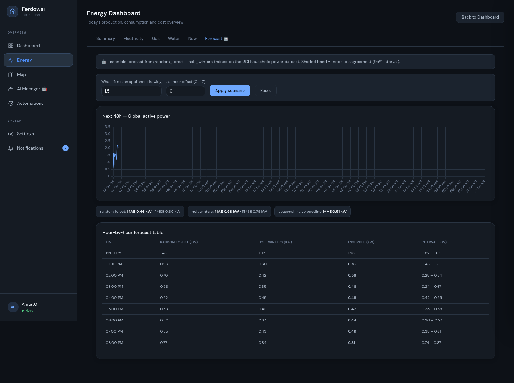
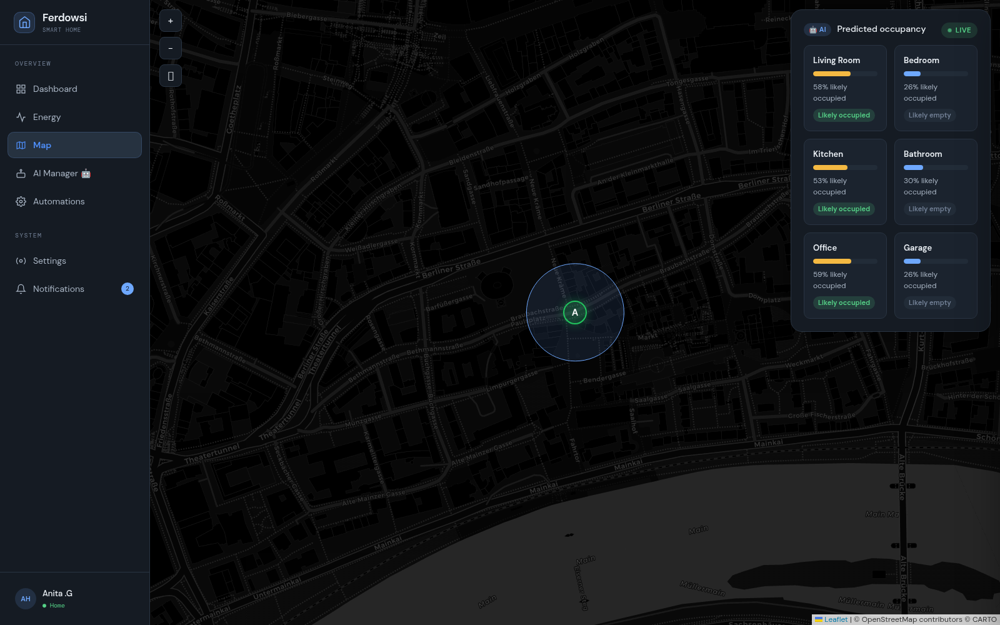
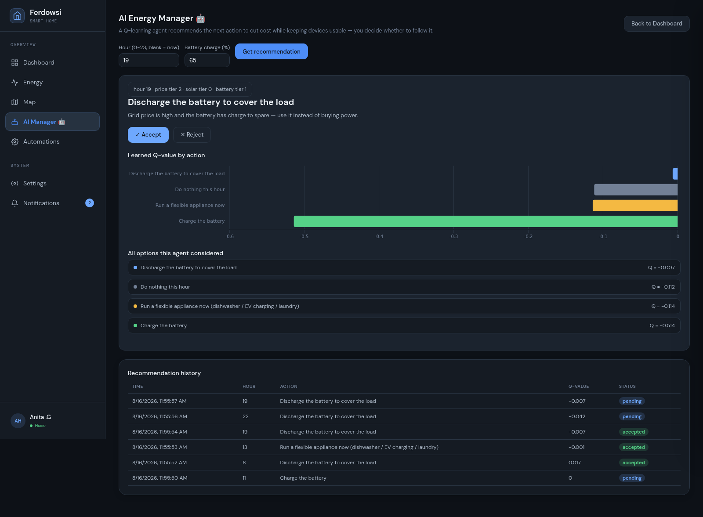

# Ferdowsi — Smart Home Dashboard

A React + Vite smart home dashboard, now paired with an optional Django backend
(`backend/`) that adds three genuinely model-backed AI features — energy
forecasting, occupancy prediction, and a prescriptive energy-management
agent — trained on real public datasets. The dashboard itself still runs
standalone with no backend at all (all device/room/automation data is
simulated, seeded locally, and persisted via `localStorage`); the backend is
additive, not required, for everything except the three 🤖-marked features
below. See [FEATURES.md](FEATURES.md), [MINDSET.md](MINDSET.md), and
[backend/README.md](backend/README.md) for the full story.


## Screenshots

| Dashboard | Live energy monitoring |
|---|---|
|  |  |

| Power flow (hover-to-highlight) | Automations |
|---|---|
|  |  |

| AI Insights |
|---|
|  |

### AI features (Django backend, real trained models)



| Energy Forecast 🤖 (RandomForest + Holt-Winters) | Predicted occupancy 🤖 (RandomForest + LogReg) |
|---|---|
|  |  |

| AI Energy Manager 🤖 (tabular Q-learning) |
|---|
|  |

## Features

- **Dashboard** — live-editable device grid, room cards with per-device on/off toggles, security status, presence detection, network status, energy distribution overview, an interactive floor plan, and a draggable dual-setpoint thermostat.
- **AI Insights** — a heuristic engine that watches live device, energy, and notification data and surfaces anomaly/suggestion cards (e.g. "higher device usage than usual", "shift usage to solar peak"). See [note below](#note-on-the-ai-features) on how this is implemented.
- **AI Security Assistant** — a simulated break-in scenario: motion is detected while no one is confirmed home, and the assistant reasons through it live, then automatically locks the doors and arms the security system — updating real app state, not just a script.
- **Energy** — Summary / Electricity / Gas / Water tabs with Chart.js charts, a "Current power flow" Sankey-style diagram (hover to highlight a single flow, dims everything else), and a **Now** tab with a simulated live power feed: a full-day power-sources chart, live gauges (battery charge, self-sufficiency, grid dependency), and a live power-flow diagram.
- **Map** — Leaflet map showing home zone and family member locations.
- **Automations** — automation rules and scene activation.
- **Notifications** — a real notification center (not just toasts): every meaningful change in the app (device toggles, thermostat setpoints, room devices, AI Assistant actions) is recorded as a persistent notification, viewable and dismissible from the bell icon.
- **Activity log** — a full log combining seeded activity history with live notifications.
- **Settings / Profile** — theme (light/dark), localization (timezone, number/date/time format, first day of week), and a Home-Assistant-style settings landing page.
- Responsive layout, light/dark theme, toast notifications, and route-level code splitting for fast initial load.
- **Energy → Forecast 🤖** — a 48h energy forecast from an ensemble (RandomForest + Holt-Winters) trained on the real [UCI household power dataset](https://archive.ics.uci.edu/dataset/235), with a prediction interval and a "what if I ran this appliance at hour X" scenario tool. Requires the Django backend.
- **Map → Predicted occupancy 🤖** — per-room occupancy probability from a RandomForest/LogisticRegression pair trained on the real [UCI Occupancy Detection dataset](https://archive.ics.uci.edu/dataset/357). Requires the backend.
- **AI Manager 🤖** — a tabular Q-learning agent recommends an hourly energy action (idle / run a flexible load / charge / discharge the battery), shows every alternative it considered with its learned Q-value, and logs your accept/reject decisions. Requires the backend.

## Tech stack

- [React 19](https://react.dev/) + [React Router 7](https://reactrouter.com/)
- [Vite](https://vite.dev/) (build tool, using the Rolldown-powered `vite` package)
- [Chart.js](https://www.chartjs.org/) / [react-chartjs-2](https://react-chartjs-2.js.org/) for charts
- [Leaflet](https://leafletjs.com/) / [react-leaflet](https://react-leaflet.js.org/) for the map
- Plain CSS (no framework/UI kit) — theme via CSS custom properties
- [Oxlint](https://oxc.rs/docs/guide/usage/linter) for linting
- **Backend** (optional, `backend/`): [Django](https://www.djangoproject.com/) + [DRF](https://www.django-rest-framework.org/), [scikit-learn](https://scikit-learn.org/), [statsmodels](https://www.statsmodels.org/), a custom [Gymnasium](https://gymnasium.farama.org/) environment — see [backend/README.md](backend/README.md).

## Getting started

```bash
npm install
npm run dev       # start the dev server (http://localhost:5173)
npm run build     # production build to dist/
npm run preview   # preview the production build locally
npm run lint       # run Oxlint
```

Requires Node.js 18+. This alone runs the full dashboard except the three
🤖-marked AI features above.

To enable those, also start the backend (see [backend/README.md](backend/README.md)
for details):

```bash
cd backend
pip install -r requirements.txt
python manage.py migrate
python manage.py train_forecast        # ~15s, downloads the UCI power dataset on first run
python manage.py train_occupancy       # ~8s, downloads the UCI occupancy dataset on first run
python manage.py train_energy_manager  # ~3s, no dataset needed
python manage.py runserver 127.0.0.1:8000
```

The frontend talks to it at `http://<page-host>:8000/api` by default (see
`.env.example` to override via `VITE_API_BASE_URL`).

## Project structure

```
src/
├─ api/             # Fetch layer for the Django backend (client.js)
├─ components/     # Reusable UI: cards, modals, charts, the thermostat dial, AI panels, etc.
├─ pages/          # One component per route (Dashboard, Energy, Map, Automations, AI Manager, Profile, Settings)
├─ layout/          # App shell: sidebar + top-level layout/outlet
├─ hooks/           # State + behavior: managed devices, notifications, live power simulation, AI insights, useForecast/useOccupancy/useEnergyManager, theme, localization, etc.
├─ data/            # Seed/mock data (devices, rooms, energy, automations, security, notifications...)
├─ styles/          # Plain CSS, split by page/feature (incl. ai-features.css)
├─ utils/           # Small formatting helpers (relative time, locale-aware number/date formatting)
├─ chartSetup.js    # Chart.js registration + shared chart options
├─ App.jsx          # Routes (lazy-loaded per page) + providers (Toast, Notifications, ErrorBoundary)
└─ main.jsx         # Entry point

backend/             # Optional Django + DRF service — see backend/README.md
├─ forecasting/      # Direction A: energy forecast (RandomForest + Holt-Winters)
├─ occupancy/        # Direction C: occupancy prediction (RandomForest + LogReg)
├─ energy_manager/   # Direction D: prescriptive Q-learning agent
└─ ml_artifacts/     # Cached datasets + trained model checkpoints (git-ignored)
```

## Notes on the simulated data

- Device/room state, notifications, and localization preferences persist in `localStorage`, so changes survive a page reload.
- The Energy → **Now** tab simulates a live power feed with a bounded random walk (no real sensors involved) and synthesizes a full day's worth of history so the chart's time axis behaves like a real Home Assistant energy dashboard.
- To wire this app to a real backend/API instead, the natural integration points are the hooks in `src/hooks/` (e.g. `useManagedDevices`, `useLivePower`, `useNotifications`) — swap their internal state/localStorage logic for real data fetching without needing to change the components that consume them.

### Note on the AI features

There are now two different kinds of "AI" in this app — worth being precise
about which is which:

- **`AIInsightsPanel` / `AISecurityAssistant` (client-only, rule-based)** —
  no model, no backend. `useAIInsights` runs plain heuristics
  (thresholds/pattern checks) over the app's own live state, and the
  Security Assistant plays back a scripted sequence of steps. The *effects*
  are real (it genuinely locks the front door and arms security in app
  state), but the *reasoning* isn't — it's a demonstration of the UX
  pattern, not a trained model.
- **Forecast / Predicted occupancy / AI Manager (🤖, backend-backed, real
  models)** — actual scikit-learn/statsmodels models and a trained
  Q-learning agent, served by `backend/` and trained on real public
  datasets with held-out test metrics. See [FEATURES.md](FEATURES.md) for
  what each one is and [MINDSET.md](MINDSET.md) for why they're built the
  way they are (and what's still simulated within them, documented
  explicitly rather than left implicit).

## License

[MIT](LICENSE)
