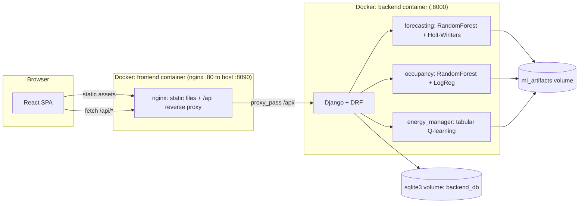

# Ferdowsi — Smart Home Dashboard

<div align="center">


[](LICENSE)
[](https://react.dev/)
[](https://vite.dev/)
[](https://www.djangoproject.com/)
[](https://scikit-learn.org/)
[](docker-compose.yml)
[](package.json)

`smart-home` · `dashboard` · `react` · `vite` · `django` · `machine-learning` · `docker` · `iot` · `energy-forecasting` · `q-learning`

</div>

A React + Vite smart home dashboard, paired with an optional Django backend
(`backend/`) that adds three genuinely model-backed AI features — energy
forecasting, occupancy prediction, and a prescriptive energy-management
agent — trained on real public datasets. The dashboard runs standalone with
no backend at all (device/room/automation data is simulated, seeded
locally, and persisted via `localStorage`); the backend is additive, needed
only for the three 🤖-marked features below. **The whole stack — frontend
and backend — is dockerized; see [Run it with Docker](#run-it-with-docker)
for the one-command path.**


## Table of contents

- [Screenshots](#screenshots)
- [Features](#features)
- [Tech stack](#tech-stack)
- [Architecture](#architecture)
- [How to use](#how-to-use)
- [Run it with Docker](#run-it-with-docker)
- [Manual setup (no Docker)](#manual-setup-no-docker)
- [Project structure](#project-structure)
- [Model performance](#model-performance)
- [Documentation map](#documentation-map)
- [Notes on the simulated data](#notes-on-the-simulated-data)
- [License](#license)

## Screenshots

| Dashboard | Live energy monitoring |
|---|---|
|  |  |

| Power flow (hover-to-highlight) | Automations |
|---|---|
|  |  |

| AI Insights |
|---|
|  |

### AI features (Django backend, real trained models)


| Energy Forecast 🤖 (RandomForest + Holt-Winters) | Predicted occupancy 🤖 (RandomForest + LogReg) |
|---|---|
|  |  |

| AI Energy Manager 🤖 (tabular Q-learning) |
|---|
|  |

## Features

| Area | What it does | Backed by |
|---|---|---|
| **Dashboard** | Live-editable device grid, room cards with per-device toggles, security status, presence detection, network status, energy distribution overview, interactive floor plan, draggable dual-setpoint thermostat | Client-side, `localStorage` |
| **AI Insights** | Heuristic engine watching live device/energy/notification data, surfaces anomaly/suggestion cards | Rule-based (see [note](#a-note-on-the-two-kinds-of-ai)) |
| **AI Security Assistant** | Simulated break-in scenario — reasons through motion-while-away live, locks doors, arms security in real app state | Rule-based, real app-state effects |
| **Energy** | Summary / Electricity / Gas / Water tabs, Sankey-style power-flow diagram, a **Now** tab with a simulated live feed, gauges, and live power-flow diagram | Client-side simulation |
| **Map** | Leaflet map with home zone + family member locations | Client-side |
| **Automations** | Automation rules and scene activation | Client-side |
| **Notifications** | Real notification center — every meaningful state change is a persistent, dismissible notification | Client-side |
| **Activity log** | Seeded history + live notifications combined | Client-side |
| **Settings / Profile** | Theme, localization, Home-Assistant-style settings landing page | Client-side |
| **Energy → Forecast** 🤖 | 48h forecast with prediction interval + "what if I ran this appliance at hour X" | RandomForest + Holt-Winters, trained on [UCI household power](https://archive.ics.uci.edu/dataset/235) |
| **Map → Predicted occupancy** 🤖 | Per-room occupancy probability | RandomForest + LogisticRegression, trained on [UCI Occupancy Detection](https://archive.ics.uci.edu/dataset/357) |
| **AI Manager** 🤖 | Recommends an hourly energy action (idle / run a flexible load / charge / discharge battery), shows every alternative considered with its learned Q-value, logs accept/reject decisions | Tabular Q-learning (648 states × 4 actions) |

Also: responsive layout, light/dark theme, toast notifications, and
route-level code splitting for a fast initial load.

#### A note on the two kinds of "AI"

- **`AIInsightsPanel` / `AISecurityAssistant`** — client-only, no model, no
  backend. Real effects (it genuinely locks the door / arms security in
  app state), but the reasoning is plain heuristics, not a trained model —
  a UX-pattern demonstration.
- **Forecast / Predicted occupancy / AI Manager (🤖)** — actual
  scikit-learn/statsmodels models and a trained Q-learning agent, served
  by `backend/`, trained on real public datasets with held-out test
  metrics. See [FEATURES.md](FEATURES.md) and [MINDSET.md](MINDSET.md).

## Tech stack

| Layer | Stack |
|---|---|
| Frontend | [React 19](https://react.dev/), [React Router 7](https://reactrouter.com/), [Vite](https://vite.dev/) (Rolldown), [Chart.js](https://www.chartjs.org/)/[react-chartjs-2](https://react-chartjs-2.js.org/), [Leaflet](https://leafletjs.com/)/[react-leaflet](https://react-leaflet.js.org/), plain CSS |
| Backend | [Django](https://www.djangoproject.com/) + [DRF](https://www.django-rest-framework.org/), [scikit-learn](https://scikit-learn.org/), [statsmodels](https://www.statsmodels.org/), a custom [Gymnasium](https://gymnasium.farama.org/) environment |
| Tooling | [Oxlint](https://oxc.rs/docs/guide/usage/linter) (lint), [Docker](https://www.docker.com/) + [Compose](https://docs.docker.com/compose/) (deploy), [nginx](https://nginx.org/) (static serving + API reverse proxy) |

## Architecture



## How to use

1. **Start the stack** — `./run.sh up` (Docker) or `npm run dev` + backend
   (manual) — see below.
2. **Dashboard** (`/`) — toggle devices/rooms, watch security/presence/
   network status, drag the thermostat dial to change setpoints.
3. **Energy** (`/energy`) — switch Summary / Electricity / Gas / Water /
   **Now** (live simulated feed) tabs; hover the power-flow diagram to
   highlight one flow; open **Forecast** 🤖 for the 48h prediction and the
   what-if tool (needs the backend).
4. **Map** (`/map`) — see home zone + family locations; open **Predicted
   occupancy** 🤖 for per-room probabilities (needs the backend).
5. **Automations** (`/automations`) — create/toggle automation rules and
   activate scenes.
6. **AI Manager** (`/ai-manager`) 🤖 — see the recommended hourly action,
   compare it against every alternative's Q-value, accept or reject it
   (needs the backend).
7. **Notifications** — click the bell icon for a live feed of every
   meaningful state change; **Profile/Settings** for theme and
   localization.

All 🤖-marked views work without the backend running too — they show a
clear "backend not reachable, run …" message instead of failing silently.

## Run it with Docker

The whole stack — frontend + backend, models included — runs with one
script. No local Node/Python setup needed, only [Docker](https://docs.docker.com/get-docker/).

```bash
./run.sh up
```

This builds both images, starts the backend (which migrates and trains any
missing model — first boot only, ~30–90s depending on machine), waits for
its healthcheck, then starts the frontend. Once it's up:

| Service | URL |
|---|---|
| Dashboard | http://localhost:8090 |
| Backend API | http://localhost:8000/api |

Other commands the same script understands:

```bash
./run.sh logs    # follow logs for both containers
./run.sh stop    # stop containers, keep data/model volumes
./run.sh down    # stop + remove containers, keep volumes
./run.sh reset   # stop + remove containers AND volumes (forces a full retrain next boot)
```

Or drive it directly with Compose:

```bash
docker compose up -d --build
docker compose logs -f
docker compose down
```

### What's in the Compose file

| Service | Image | Exposes | Persists |
|---|---|---|---|
| `backend` | `backend/Dockerfile` (Python 3.11 + gunicorn) | `8000` | `backend_db` (sqlite), `ml_artifacts` (trained models + cached datasets) |
| `frontend` | `Dockerfile` (Node 20 build → nginx alpine) | `8090 → 80` | — (static build) |

The frontend is built with `VITE_API_BASE_URL=/api` (relative), and nginx
(`nginx.conf`) reverse-proxies `/api/` and `/admin/` to the backend
container by service name — so the same image works on any host/port
without a rebuild.

## Manual setup (no Docker)

```bash
npm install
npm run dev       # dev server → http://localhost:5173
npm run build     # production build → dist/
npm run preview   # preview the production build
npm run lint       # run Oxlint
```

Requires Node.js 18+. This alone runs the full dashboard except the three
🤖-marked AI features.

To enable those, also run the backend (see [backend/README.md](backend/README.md)):

```bash
cd backend
python3 -m venv venv && source venv/bin/activate
pip install -r requirements.txt
python manage.py migrate
python manage.py train_forecast
python manage.py train_occupancy
python manage.py train_energy_manager
python manage.py runserver 127.0.0.1:8000
```

The frontend talks to it at `http://<page-host>:8000/api` by default (see
`.env.example` to override via `VITE_API_BASE_URL`).

## Project structure

```
src/
├─ api/             # Fetch layer for the Django backend (client.js)
├─ components/     # Reusable UI: cards, modals, charts, thermostat dial, AI panels, etc.
├─ pages/          # One component per route
├─ layout/          # App shell: sidebar + top-level layout/outlet
├─ hooks/           # State + behavior: devices, notifications, live power sim, AI insights, theme, etc.
├─ data/            # Seed/mock data
├─ styles/          # Plain CSS, split by page/feature
├─ utils/           # Formatting helpers
├─ chartSetup.js    # Chart.js registration + shared options
├─ App.jsx          # Routes (lazy-loaded) + providers
└─ main.jsx         # Entry point

backend/             # Optional Django + DRF service — see backend/README.md
├─ forecasting/      # Energy forecast (RandomForest + Holt-Winters)
├─ occupancy/        # Occupancy prediction (RandomForest + LogReg)
├─ energy_manager/   # Prescriptive Q-learning agent
└─ ml_artifacts/     # Cached datasets + trained model checkpoints (git-ignored)

Dockerfile            # Frontend image (Node build → nginx)
backend/Dockerfile     # Backend image (Python + gunicorn)
backend/entrypoint.sh  # migrate → train-if-missing → serve
nginx.conf              # Static serving + /api reverse proxy
docker-compose.yml       # Both services + named volumes
run.sh                   # One-command build/up/down/reset/logs wrapper
```

## Model performance

| Model | Metric | Value | vs. baseline |
|---|---|---|---|
| Forecast — RandomForest | MAE / RMSE (hourly kW) | 0.457 / 0.603 | seasonal-naive: 0.505 / 0.764 |
| Forecast — Holt-Winters | MAE / RMSE (hourly kW) | 0.596 / 0.800 | seasonal-naive: 0.505 / 0.764 |
| Occupancy — RandomForest | Accuracy / F1 / ROC-AUC | 0.966 / 0.931 / 0.994 | — |
| Occupancy — LogisticRegression | Accuracy / F1 / ROC-AUC | 0.990 / 0.980 / 0.995 | — |
| Energy Manager | Training | 648 states × 4 actions, 4,000 episodes, ~3s to converge | — |

Full tables, interpretation, and threats-to-validity in [ANALYSIS.md](ANALYSIS.md).

## Documentation map

This project is also written to be a usable basis for a real paper:

| Doc | What's in it |
|---|---|
| [ALL_FEATURES.md](ALL_FEATURES.md) | Complete feature/route/API/dataset/algorithm inventory |
| [THEORY.md](THEORY.md) | Formal problem statements, algorithms, equations, citations |
| [ANALYSIS.md](ANALYSIS.md) | Result tables, honest interpretation, limitations & threats to validity |
| [INTUITION.md](INTUITION.md) | Plain-language reasoning behind each design choice, no equations |
| [MINDSET.md](MINDSET.md) | Why the project is built the way it is, working-style principles |
| [ROADMAP.md](ROADMAP.md) | What's done, deferred (and why), explicitly not planned |
| [TODO.md](TODO.md) | Actionable next steps |
| [CHANGELOG.md](CHANGELOG.md) | Chronological log of what changed and why |
| [backend/README.md](backend/README.md) | Backend setup/run instructions, API reference |

## Notes on the simulated data

- Device/room state, notifications, and localization preferences persist in
  `localStorage`, so changes survive a page reload.
- The Energy → **Now** tab simulates a live power feed with a bounded
  random walk (no real sensors involved) and synthesizes a full day's
  history so the chart's time axis behaves like a real Home Assistant
  energy dashboard.
- To wire this app to a real backend/API instead, the natural integration
  points are the hooks in `src/hooks/` (e.g. `useManagedDevices`,
  `useLivePower`, `useNotifications`) — swap their internal
  state/localStorage logic for real data fetching without touching the
  components that consume them.

## License

[MIT](LICENSE)
